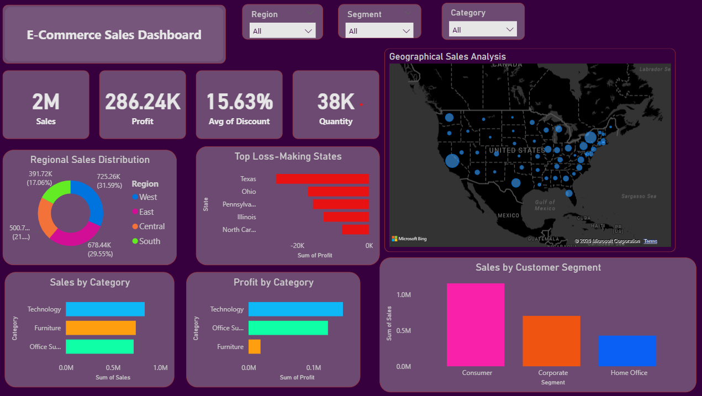

# E-Commerce Sales & Customer Insights Dashboard

## Project Overview
This project analyzes e-commerce sales data to uncover business insights related to sales, profit, customer segments, discounts, and regional performance.

The project includes:
- Python-based data analysis
- SQL business queries
- Interactive Power BI dashboard

---

## Tools & Technologies Used
- Python
- Pandas
- NumPy
- Matplotlib
- Seaborn
- MySQL
- Power BI
- JupyterLab

---

## Key Business Insights
- Technology category generated the highest sales and profit.
- Consumer segment contributed the maximum revenue.
- West region recorded the highest sales.
- Texas emerged as the top loss-making state.
- Higher discounts negatively impacted profitability.

---

## Dashboard Features
- Interactive KPI cards
- Sales and profit analysis
- Region-wise sales distribution
- Customer segment analysis
- Loss-making state identification
- Interactive slicers and filters
- Geographic sales map

---

## Dashboard Preview

---

## Author
Sakshi Tanwar
